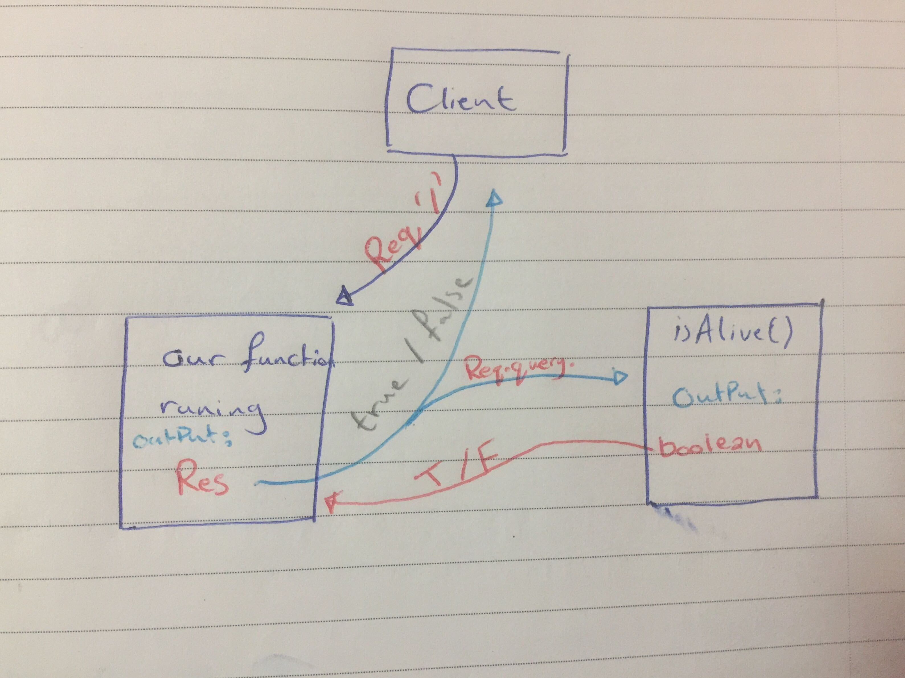

# LAB: Node Ecosystem :v:
Prep: Lab 00 - Deployment Workshop

### Author: Yasmin Adaileh :sunglasses:

### Links and Resources :paperclip:
* [submission PR](https://github.com/yasmin-401-advanced-javascript/lab-00/pull/1)
* [travis](https://travis-ci.com/github/yasmin-401-advanced-javascript/lab-00)
* [front-end](https://yasmin-lab00.herokuapp.com/)

#### Documentation :file_folder:
* [jsdoc](https://yasmin-lab00.herokuapp.com/docs/)

### Modules
#### `pol.js`
##### Exported Values and Methods

###### `isAlive(dead) -> boolean`
The isAlive() method returns a boolean based on the arg sent in.

### Setup
#### `.env` requirements
* `PORT` - Port Number

#### Running the app :runner:
* `npm start`
* Endpoint: `/` _home route_
  * Returns boolean
* Endpoint: `/docs`
  * Renders Developer Documentation _jsdoc_
  
#### Tests
* Unit Tests: `npm run test`
* Lint Tests: `npm run lint`


#### UML



--------------------------------------------------

so what I did is :
A) make new repo, clone it and I had copied what we have in the starter code file to my repo file.
we need to notict that we have:
        1.  a file with **travis.yml** which will run our test in real time and its govern how the test run when thet're deployed out to this travis service. 
        2. a file called __ test __ here where you javascript test file would go.

        ```
        cat package.json
        {
        "name": "401-js-proof-of-life",
        "version": "1.0.0",
        "description": "Proof of Life",
        "main": "index.js",
        "scripts": {
            "start": "node index.js",
            "lint": "eslint '**/*.js'",
            "test": "jest --verbose --coverage",
            "test-watch": "jest --watchAll --verbose --coverage",
            "jsdoc": "jsdoc -c ./docs/config/jsdoc.config.json"
        },
        "author": "John Cokos",
        "license": "MIT",
        "devDependencies": {
            "eslint": "^6.1.0",
            "eslint-plugin-react": "^7.14.3",
            "jest": "^24.8.0"
        },
        "dependencies": {
            "express": "^4.17.1"
        }
        }
        ```

        in script section we have 
        1. start: to start our server 
        2. lint: let us run those linter which is same test we see in our editor where we make the red squiggles under our bad code
        it run with _"eslint '**/*.js'"_
        this is going to do a lint check or check all of your files in this installation to see that they're valid. so it will enrollment the same error that you've seen in the browser or in your editor 
        3. test : run our jest tests.
        4. jsdoc: a way to generate documantation from our server files,
        using this configuration file _./docs/config/jsdoc.config.json_ this will produce documentation for you

B) kick off **NPM install** 

* .eslintignore: which directory folders where going to not have our linter look into
* .eslintrc.json: the rules thar run how your literature works  

**note**:
* we need to install jsdoc and run it so we can see the docs files 
        
### lets have a look in ous index.js (server) 

here we have the **jsdoc** its a way to documantation your js file

        ```
        /**
        * Simple Server
        * @module index
        */
        ```
**pol.js** thats a library that we'll use and some work with.

        ```
        const pol = require('./pol.js');
        ```

this comment indicates the code below its going to be under request handler and it will take two parameters (request , response)
        ```
        /**
        * / Request Handler (All Routes)
        * @param req
        * @param res
        */
        ```
this function will going to set headers, set status code, run this **isItAlive** method from the pol (**proof-of-live** library) and then its going to write out whatever the function produces  
        ```
        function requestHandler(req,res) {
        res.setHeader('Content-Type', 'text/html');
        res.statusCode = 200;
        let isItAlive = pol.isAlive(req.query.dead).toString();
        res.write( isItAlive );
        res.end();
        }
        ```

the pol.js file is very simple file its have a module
have commented as a modules 
        ```
        /**
        * Proof Of Life
        * @module pol
        */
        ```
and have one function commented as a method that takes a one parameter and return a boolean based on the parameter you are sending
        ```
        /**
        * Proof of life - will return a boolean value
        * @param dead
        * @returns {boolean}
        * @function isAlive
        */
        ```

        ```
         const isAlive = function(dead = false) {
        return !(dead);
        };
        ```

to run the server we need to run this command in the terminal because we don't have .env file.
        ```
        export PORT=5000
        ```

C) ACP to master, and creat a pull request
D) do the heroku deployment and the travis ci test
E) update the README.md file.


And thats it GOOD job for me :clap: :joy: